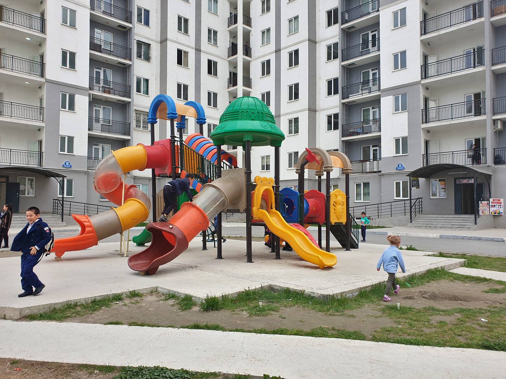

Узбеки гостеприимные. Очень. Не удивляйтесь, если вас будут звать на шашлыки или
чай после минимального знакомства. Но надо научиться отличать простую вежливость
от искреннего намерения. Если после одного-двух отказов продолжают звать - вас
точно ждут. Знакомыми здесь обрасти несложно. В маленьком магазинчике вас будут
узнавать после двух-трех посещений.

Узбеки не любят здороваться на ходу. Помимо стандартного приветствия обязательно
поинтересуются: "Как вы?". А так же как ваши родственники и незавершенные дела.
Если упомянуть о какой-то проблеме, могут бросить все и попытаются помочь. Часто
с привлечением знакомых. Что меня, как интроверта, больше всего удивляет, что
такое общение абсолютно не напрягает. Пожалуй, это от того что такой стиль
общения никто специально не навязывает. Если вы спешите, то вполне естественно
ограничиться стандартным этикетом, а если расслаблены - то простая покупка на
рынке быстро перерастет в увлекательную беседу.

Узбекистан это светское государство и к любым чужим религиям/взглядам относятся
спокойно. Нет таких серьезных ограничений как в других мусульманских странах,
несмотря на то что 95% исповедует ислам. Женщин в платках не очень много,
алкоголь не считается большим грехом (если только не в Уразу). Еще здесь
гармонично смотрится смесь культур. Мусульмане празднуют Пасху и Рождество,
православные соблюдают Уразу. И конечно радостно поздравляют друг-друга с
религиозными праздниками.

По-русски очень хорошо говорят в Ташкенте, Самарканде и Бухаре. Русский язык
здесь повсеместно используется на вывесках, ценниках, в рекламе. Много школ и
садиков с русскоязычными классами. Хотя русский язык и не имеет официального
статуса, это все еще важнейший язык межнационального общения и документооборота.
Считается, что дети знающие помимо родного еще и русский будут зарабатывать чуть
больше. Но в других регионах бывает сложно найти кого-нибудь со знанием русского
или английского.

Десоветизация в Узбекистане проходит спокойно и непринужденно. Это как
обновление дома - узбеки просто выстраивают комфортную для себя среду заменяя
чужеродные элементы. Остаются некоторые названия улиц (например Гагарина),
сохраняются культурные заведения (театр имени Чехова). Даже современный герб -
это редизайн советской версии.

Узбекистан считается достаточно безопасной страной, по уровню преступности
сравнимой с европейскими странами. Так было не всегда, местные говорят что лет 5
назад было немного хуже. На верхних и нижних этажах до сих пор ставят решетки на
окнах, хотя в новых домах уже реже. Но самая главная опасность поджидает на
дороге. Пешеходов не принято пропускать, на зеленый свет многие переходят
перебежками. Ремни безопасности здесь не любят. Пристегнув ремень в такси вы
рискуете испачкать одежду, ремни пыльные из-за невостребованности. В Chevrolet
местной сборки сигнал непристегнутого ремня отключен с завода, зато вместо
пластины сигнала на руле предусмотрены две кнопки.

## Дети в Узбекистане {#children}

Узбекистан - одна из немногих постсоветских стран, где население не уменьшается,
а растет. Очень быстро. С 1991 года выросло более чем в полтора раза, до 36 млн
человек. Вообще, брак и дети для узбеков занимают важнейшее место в жизни. На
свадьбу копят много лет, задолго до выбора партнера. Невесту обычно выбирают
родители. Пригласить под тысячу гостей - нормальная практика. По традиции,
невеста переезжает в семью жениха. Первые несколько лет она перенимает опыт
семейного быта, потом молодая семья может начать жить отдельно, если есть
возможность. Дети появляются быстро, средний возраст первых родов - 23 года.

Во дворах не принято пристально присматривать за детьми. Бывает, на площадке
много детей разного возраста и ни одного взрослого. Старшие присматривают за
младшими. Когда наша дочка приходит на новую площадку, дети быстро включают ее в
свою игру. Не важно, говорят ли они по-русски или нет. За несколько месяцев я ни
разу не сталкивался с агрессией среди детей, хотя дома это было обычным
явлением.

